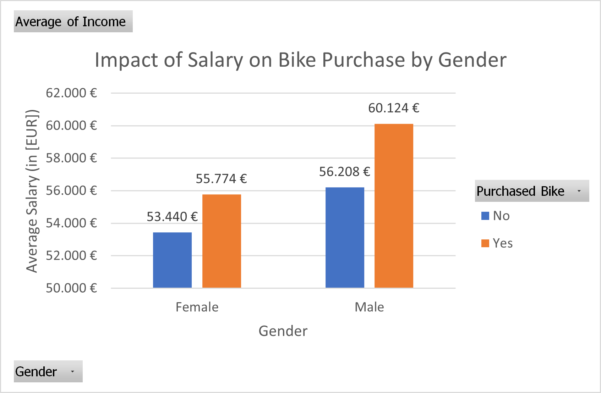
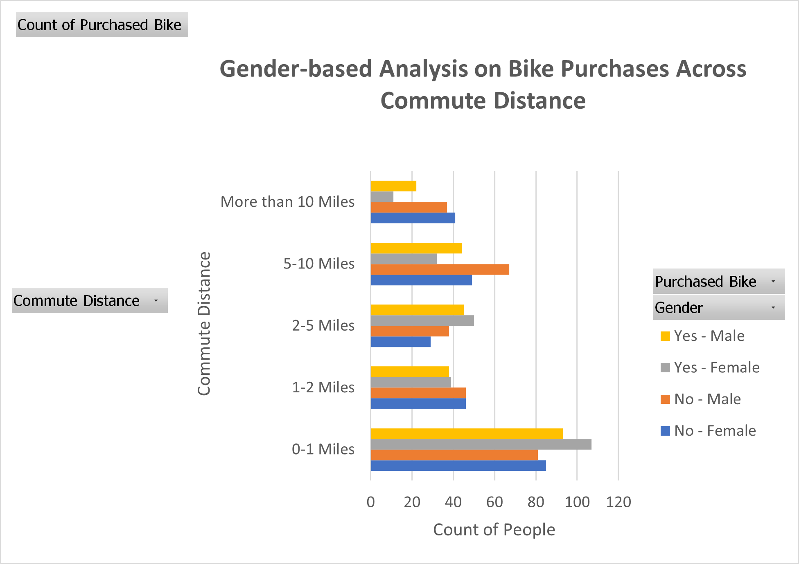
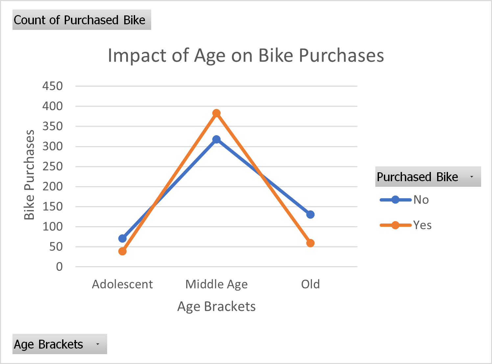
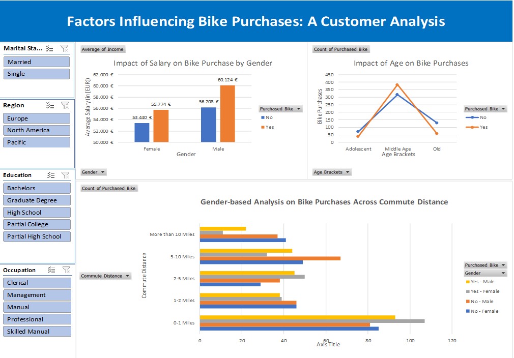

#Bike Sales Analysis Project

## Introduction
This project analyzes a dataset on bikes sales to explore customer demographics and their purchasing behaviors. It marks the beginning of my journey as a Data Analyst, focusing on data cleaning, analysis and visualization using Excel. The project follow a guided tutorial from AlexTheAnalyst, to which I have added personal insights. Here is the link to AlexTheAnalyst Youtube channel: [AlexTheAnalyst]( https://www.youtube.com/@AlexTheAnalyst).

## Objectives
1.	**Data Cleaning:** Prepare the dataset by addressing duplicates, missing values, errors, and inconsistencies. 
2.	**Customer Profiling:** Identify demographic factors influencing bike purchases. 
3.	**Purchase Trends:** Uncover patterns related to income, commute distance, age, and more. 
4.	**Data Visualization:** Design an interactive dashboard to present key findings to stakeholder, in a clear and concise manner. 

##Dataset Overview
•	**Dataset**: [BikeDataset](https://github.com/AlexTheAnalyst/Excel-Tutorial/blob/main/Excel%20Project%20Dataset.xlsx)
•	 **Columns**:
1.	ID,
2.	Marital Status (Married or Single),
3.	Gender (Male or Female),
4.	Income,
5.	Children, 
6.	Education ( Bachelors, Graduate Degree, High School, Partial College, Partial High School),
7.	Occupation (Clerical, Management, Manual, Professional, Skilled Manual),
8.	Home Owner, 
9.	Cars,
10.	Commute Distance (0-1 Miles, 1-2 Miles, 2-5 Miles, 5-10 Miles, More than 10 Miles),
11.	Region (Europe, North America, Pacific),
12.	Age,
13.	Purchased Bike.

## Process
### ** 1) Data Cleaning**
To ensure the dataset was accurate and ready for analysis, I performed:
1.	**Duplicates Removal:** Identify  and removed 26 duplicate rows to maintain the integrity of the data.
2.	**Data Type Standardization:** Ensured consistency in data types across columns. For example, converting salaries into the correct currency data type. 
3.	**Improved Clarity:** Replaced abbreviations like “M” and “S” in the Marital Status column with “Married” and “Single”, or “M” and “F” in the Gender column with “Male” and “Female”. 
4.	**Filtering for Anomalies:**  Applied filters to column headers to identify and address inconsistencies in column values.
5.	**Age Categorization:** to simplify future interpretation and visualization, I grouped the age data into three brackets:

•	0-30 : Adolescent
•	31-54 : Middle Age
•	55+ : Old
I used the following nested IF function to automate the categorization:
`=IF(L2>=55;"Old";IF(L2>=31;"Middle Age";IF(L2<31;"Adolescent";"Invalid")))`
The dataset is now clean and ready for the analysis.

### **2) Exploratory Data Analysis (EDA)**
To discover insights and relationships within the dataset, I have created different Pivot Tables:
•	**Salary and Bike Purchases:** I analyzed the correlations between the salaries and likelihood of purchasing a bike, segmented by gender. Since the comparison is between salaries (continuous variable) and bike purchases (binary variable), I used a clustered bar chart. 

•	**Commute Distance and Bike Purchases:** I investigated how commute distance influences bike purchases, segmented by gender. A vertical clustered bar effectively displays the trend of decreasing bike purchases as commute distance increases. 

•	**Age and Bike Purchases:** I explored how age influences bike purchase decision using a line chart, with two lines representing “Yes” (bike purchase) and “No” ( no bike purchase) for each age group. 

•	**Other Factors:** I analyzed the impact of car ownership, home ownership and number of children on bike purchases. 
Additional slicers were included in the dashboard to allow users to filter results by marital status, education level, occupation, and region. While these dimensions were not the primary focus of the analysis, they provide users with flexibility to explore patterns and insights tailored to specific segments.

## Results and Key Insights
•	**Salary Influence on Bike Purchases:**

1.	Income emerges as a key determinant in bike purchases, with significant differences observed between genders and purchase behaviors. Higer-income individuals are more likely to purchase bikes (average purchaser salary: €60.000 for men and €56.000 for women).
2.	Man bike purchaser have higher average salaries compared to female purchaser. For the non-purchaser counterparts, the difference in average salaries between genders is less pronounced.

•	**Commute Distance and Bike Purchases:**

1.	As commute distance increases, the proportion of people purchasing bikes generally decreases. This suggests that longer commutes are less likely to be undertaken by bike.
2.	Males are more likely to purchase bikes across all commute distances compared to females.
Specific Observations:
•	**0-1 Miles:** Both males and females have a high proportion of bike purchases. This indicates that short commutes are highly conducive to cycling.
•	**1-2 Miles:** Bike purchases remain high for both genders, although the proportion starts to decrease slightly.
•	**2-5 Miles:** The proportion of bike purchases drops significantly for both genders.
•	**5-10 Miles:** Bike purchases continue to decline, with a more pronounced drop for females.
•	**More than 10 Miles:** Bike purchases are minimal for both genders, indicating that very long commutes are rarely undertaken by bike.

•	**Age and Bike Purchases:**

1.	There is a clear peak of purchases in the “Middle Age” group (31-54 years).
2.	Both the "Adolescent" and "Old" show lower purchase rates, highlighting a potential gap in the market.

•	**Other Factors:**

1.	**Car Ownership:** The analysis showed a negative correlation between car ownership and bike purchases, suggesting that individual with fewer cars are more likely to purchase bikes.
2.	**Home Ownership:** Homeowners also showed a higher tendency to purchase bikes.
3.	**Number of Children:**  Interestingly, there was no significant difference in bike purchases based on the number of children, except for a surprising decrease in purchases for people with five children.
Here the complete dashboard: 

## Conclusion and Recommendations 
The analysis demonstrates that: 
•	**Income is a significant factor influencing bike purchases.** Higher-income individuals are more likely to buy bikes. This suggest that marketing campaigns could target this demographics, emphasizing premium features and benefits. Additionally, tailoring campaigns to address gender-specific need and preferences might be beneficial. 

•	**Commute distance plays a crucial role in bike purchasing decisions.** Shorter commutes are more likely to be perceived as convenient for cycling. Longer commutes might involve factors such as traffic, hills, lack of dedicated bike lanes, making them less appealing for cycling. Addressing infrastructure challenges for those commutes—such as safe bike lanes—could expand the appeal of cycling for commuters beyond short distances.

•	**The “Middle Age” group should be the primary target market for bike retailers.** This group likely has disposable income, leisure time, and a desire for outdoor activities compared to the “Adolescent” group, and overall better health and higher activity levels compared to the “Old” group. Bike retailers could develop targeted marketing campaigns for the “Middle Age” group, emphasizing features like comfort, durability, and health benefits.
An interactive dashboard summarizing these findings is available here: [BikeSalesDashboard](https://github.com/elenatassotti/Bike-Sales-Analysis-Project/blob/main/BikeAnalysisDashboard.xlsx).
